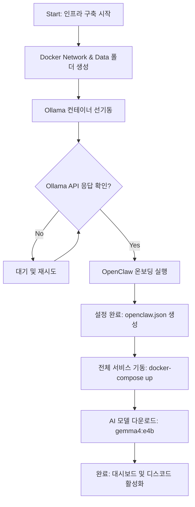

# 🚀 AI Agent Infrastructure Setup Guide (M4 Mac)

이 문서는 Ollama, n8n, OpenClaw를 도커(Docker) 기반으로 통합하여 나만의 AI 에이전트 인프라를 구축하는 과정을 기록합니다.

## Overview

- 목적: 로컬 LLM(M4 최적화) 기반의 자동화 에이전트 환경 구축
- 핵심 스택:
  - Ollama: 로컬 AI 모델 실행 엔진 (gemma4:e4b 사용)
  - n8n: 복잡한 워크플로우 및 외부 서비스 연동 자동화
  - OpenClaw: 디스코드 연동 및 에이전트 게이트웨이
  - Docker Compose: 모든 서비스의 컨테이너화 및 관리

## Project Structure

```
my-ai-agent/
├── data/               # 서비스별 영속 데이터 (Git 제외)
│   ├── ollama/         # AI 모델 파일 및 설정
│   ├── n8n/            # 자동화 워크플로우 및 사용자 데이터
│   └── openclaw/       # 에이전트 설정 및 세션 로그
├── docker-compose.yml  # 인프라 정의 파일
├── setup.sh      # 초기화 및 실행 스크립트
├── .env                # 민감 정보 (토큰, API 키)
└── .gitignore          # 깃 제외 목록
```

## Configuration

### 📂 docker-compose.yml

서비스 간의 네트워크와 볼륨 연결을 정의합니다. 특히 environment 설정 시 매핑 방식(Key: Value)을 사용하여 호환성을 확보했습니다.

### 📂 .env

실제 토큰 값은 깃에 노출되지 않도록 별도로 관리합니다.

```bash
# .env
OPENCLAW_GATEWAY_TOKEN=5d307xxxx

DISCORD_SERVER_ID=14xxx
DISCORD_BOOKING_CHANNEL_ID=1491xxx
DISCORD_BOOKING_BOT_TOKEN=MTQ5MTcxxxxx
```

### 📂 openclaw.json

보안과 관련된 부분은 환경 변수를 참조하도록 설정합니다.

```json
  "gateway": {
    "mode": "local",
    "auth": {
      "mode": "token",
      "token": "${OPENCLAW_GATEWAY_TOKEN}"
    },
```

## Setup Flow

아래 도표는 시스템이 하드웨어 준비부터 최종 모델 가동까지 어떤 단계를 거치는지 보여줍니다.



🔍 과정 상세 설명

1. 환경 준비: 도커 간 통신을 위한 내부 네트워크(ai-agent-network)를 만들고, 데이터를 영구 저장할 data/ 하위 폴더들을 생성합니다.
2. Ollama 선기동: OpenClaw가 설정 과정에서 모델 공급자(Ollama)의 상태를 확인하므로, Ollama를 먼저 띄워 API 응답이 가능한 상태로 만듭니다.
3. OpenClaw 온보딩: 대화형 CLI를 통해 디스코드 봇 토큰, 허용 채널 ID, 모델명(ollama/gemma4:e4b)을 입력하여 핵심 설정 파일을 생성합니다.
4. 전체 스택 런칭: 인프라의 모든 구성 요소(n8n, OpenClaw, Ollama)를 백그라운드 모드로 동기화하여 기동합니다.
5. 모델 배포: M4 칩에 최적화된 양자화 모델을 Ollama 엔진에 적재하여 실제 추론이 가능한 상태로 마무리합니다.

## OpenClaw 보안 및 기기 승인 (Pairing)

OpenClaw 접속 시 보안을 위해 브라우저 기기 승인 절차가 필요합니다.

기기 목록 확인:

```bash
docker exec -it openclaw node dist/index.js devices list
```

기기 승인:

```bash
docker exec -it openclaw node dist/index.js devices approve <device_id>
```

## 유지보수 및 운영 (Maintenance)

시스템의 상태를 확인하거나 변경할 때 자주 사용하는 명령어 모음입니다.

| 작업 분류              |                            실행 명령어                             | 설명                                                    |
| :--------------------- | :----------------------------------------------------------------: | :------------------------------------------------------ |
| **서비스 시작**        |                       `docker-compose up -d`                       | 모든 서비스를 백그라운드에서 실행                       |
| **서비스 중지**        |                       `docker-compose down`                        | 모든 서비스를 중지하고 컨테이너 제거 (데이터는 보존)    |
| **상태 확인**          |                        `docker-compose ps`                         | 현재 실행 중인 컨테이너 목록 및 포트 확인               |
| **로그 모니터링**      |                `docker-compose logs -f [서비스명]`                 | 특정 서비스(openclaw, ollama 등)의 실시간 로그 확인     |
| **서비스 재시작**      |                `docker-compose restart [서비스명]`                 | 설정 변경 후 특정 서비스만 다시 불러오기                |
| **모델 추가/업데이트** |           `docker exec -it ollama ollama pull [모델명]`            | Ollama에 새로운 AI 모델을 추가하거나 업데이트           |
| **기기 승인(Pairing)** | `docker exec -it openclaw node dist/index.js devices approve [ID]` | 새로운 브라우저에서 접속 시 기기 권한 승인              |
| **리소스 정리**        |                      `docker system prune -f`                      | 사용하지 않는 오래된 이미지나 네트워크 삭제 (용량 확보) |
