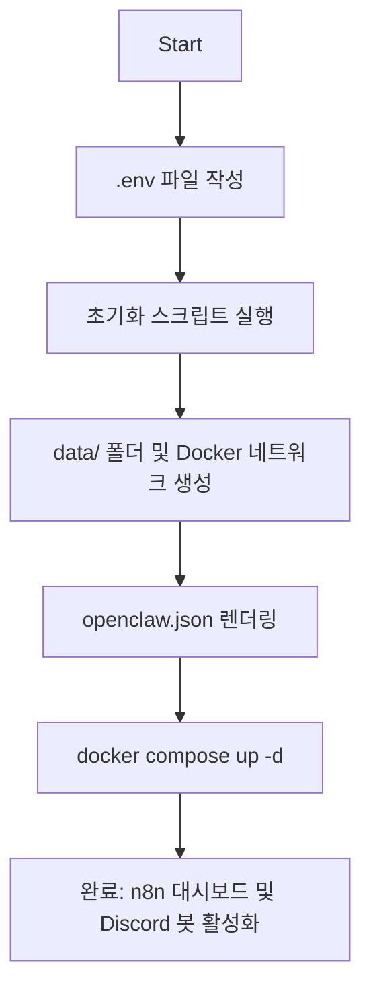

# AI Agent Infrastructure Setup Guide

이 문서는 n8n, OpenClaw를 도커(Docker) 기반으로 통합하여 AI 에이전트 인프라를 구축하는 과정을 기록합니다.

## Overview

- 목적: 클라우드 LLM 기반의 자동화 에이전트 환경 구축
- 핵심 스택:
  - n8n: 복잡한 워크플로우 및 외부 서비스 연동 자동화
  - OpenClaw: 디스코드 연동 및 에이전트 게이트웨이
  - Gemini API: LLM 추론 (Google Gemini 2.5 Flash)
  - Docker Compose: 모든 서비스의 컨테이너화 및 관리

## Project Structure

```
my-ai-agent/
├── config/             # 서비스별 설정 템플릿 (Git 관리)
│   └── openclaw/
│       └── openclaw.template.json
├── data/               # 서비스별 영속 데이터 (Git 제외)
│   ├── n8n/            # 자동화 워크플로우 및 사용자 데이터
│   └── openclaw/       # 에이전트 설정 및 세션 로그
├── prompts/            # 에이전트 프롬프트 파일 (Git 관리)
│   └── openclaw/
│       ├── SOUL.md
│       └── skills/
├── scripts/            # 유틸리티 스크립트
├── docker-compose.yml  # 인프라 정의 파일
└── .env                # 민감 정보 (토큰, API 키)
```

> 루트의 쉘 스크립트 목록과 사용법은 각 스크립트 파일 상단 주석을 참고합니다.

## Configuration

### `.env`

실제 토큰 값은 Git에 노출되지 않도록 별도로 관리합니다. `.env.example`을 복사해 작성합니다.

```bash
# n8n
N8N_HOST=0.0.0.0
N8N_PATH=/
N8N_ENCRYPTION_KEY=<random_key>
WEBHOOK_URL=https://<domain>/
N8N_BOOKING_WEBHOOK_URL=https://<domain>/webhook/my-ai-agent?type=booking

# OpenClaw
OPENCLAW_BASE_PATH=/openclaw/
OPENCLAW_GATEWAY_TOKEN=<token>

# Discord
DISCORD_SERVER_ID=<server_id>
DISCORD_BOOKING_CHANNEL_ID=<channel_id>
DISCORD_BOT_TOKEN=<bot_token>

# LLM
GEMINI_API_KEY=<api_key>
```

### `openclaw.template.json`

보안 관련 항목은 환경 변수를 참조하도록 설정합니다.
`.env` 값이 렌더링 스크립트를 통해 `data/openclaw/openclaw.json`으로 생성됩니다.

```json
"gateway": {
  "mode": "local",
  "auth": {
    "mode": "token",
    "token": "${OPENCLAW_GATEWAY_TOKEN}"
  }
}
```

## Setup Flow



1. **환경 파일 준비**: `.env.example`을 `.env`로 복사하고 각 항목 입력
2. **초기화 실행**: 초기화 스크립트를 최초 1회 실행 — `data/` 폴더 생성, `openclaw.json` 렌더링, 컨테이너 기동
3. **이후 관리**: 관리 스크립트 사용 (초기화 스크립트는 최초 1회 전용)

## OpenClaw 보안 및 기기 승인 (Pairing)

OpenClaw 접속 시 보안을 위해 브라우저 기기 승인 절차가 필요합니다.

```bash
docker exec -it openclaw node dist/index.js devices list
docker exec -it openclaw node dist/index.js devices approve <device_id>
```

> 관리 스크립트에 원격 승인 명령이 포함되어 있습니다. 스크립트 주석을 참고하세요.

---

## 부록: 로컬 LLM 설치 (선택, native)

> Ollama Docker 컨테이너는 현재 비활성화 상태입니다.
> 로컬 LLM이 필요한 경우 호스트 머신에 native로 설치하고, n8n/openclaw에서 `http://host.docker.internal:11434`로 접근합니다.

### macOS

```bash
brew install ollama
ollama serve
ollama pull llama3.2:3b
```

### Linux (서버)

```bash
curl -fsSL https://ollama.com/install.sh | sh
ollama pull llama3.2:3b
```

### 환경 변수

`.env`의 `OLLAMA_BASE_URL`이 n8n에 전달됩니다:

```bash
OLLAMA_BASE_URL=http://host.docker.internal:11434
```
